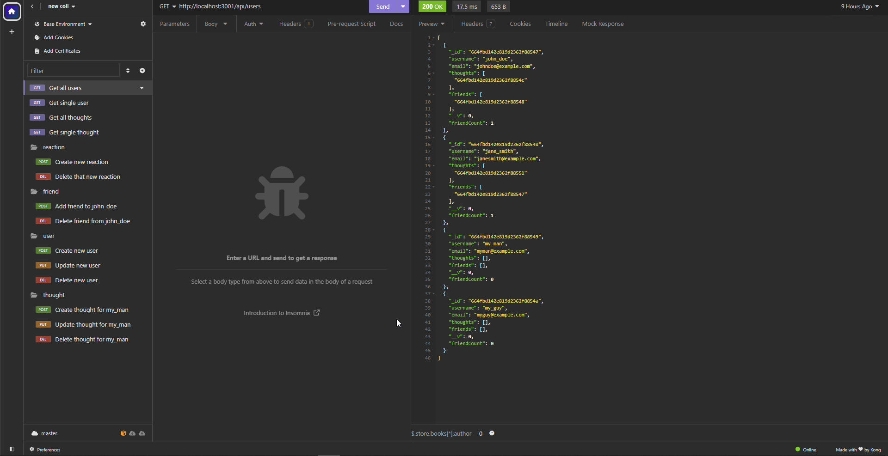

# Social Network API

## Goal: Create a Social Network API using NoSQL
This repository should show that I can properly create a social network API where users can share their thoughts, reactions, and make friends lists.

## Acceptance Criteria
- GIVEN a social network API
- WHEN I enter the command to invoke the application
- THEN my server is started and the Mongoose models are synced to the MongoDB database
- WHEN I open API GET routes in Insomnia for users and thoughts
- THEN the data for each of these routes is displayed in a formatted JSON
- WHEN I test API POST, PUT, and DELETE routes in Insomnia
- THEN I am able to successfully create, update, and delete users and thoughts in my database
- WHEN I test API POST and DELETE routes in Insomnia
- THEN I am able to successfully create and delete reactions to thoughts and add and remove friends to a user’s friend list

## Command Line Screenshots

## Video Link
[Usage Video Link](https://drive.google.com/file/d/15HVr8kRs6nd4dVMT4-mw65c-jxZbauxT/view?usp=sharing)